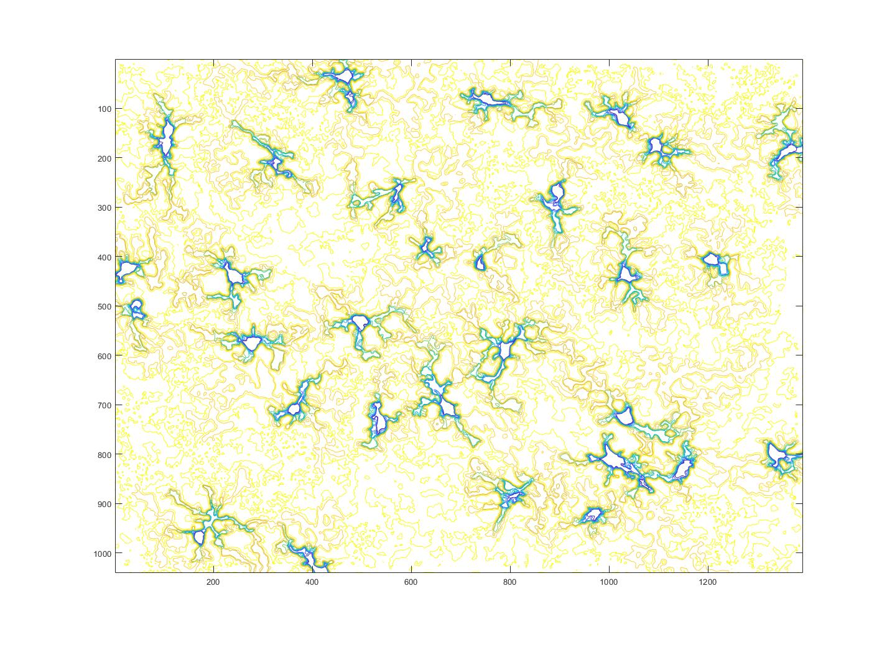
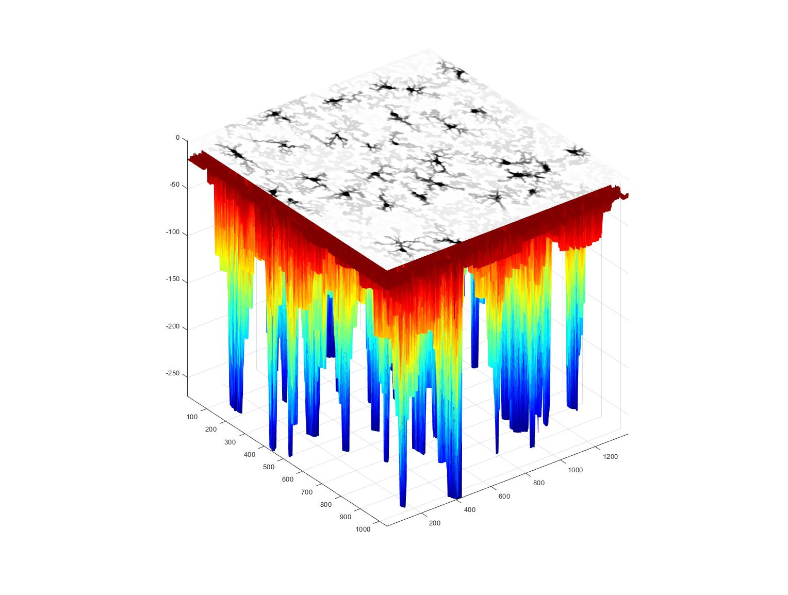
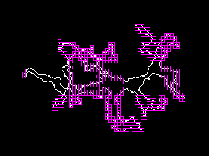
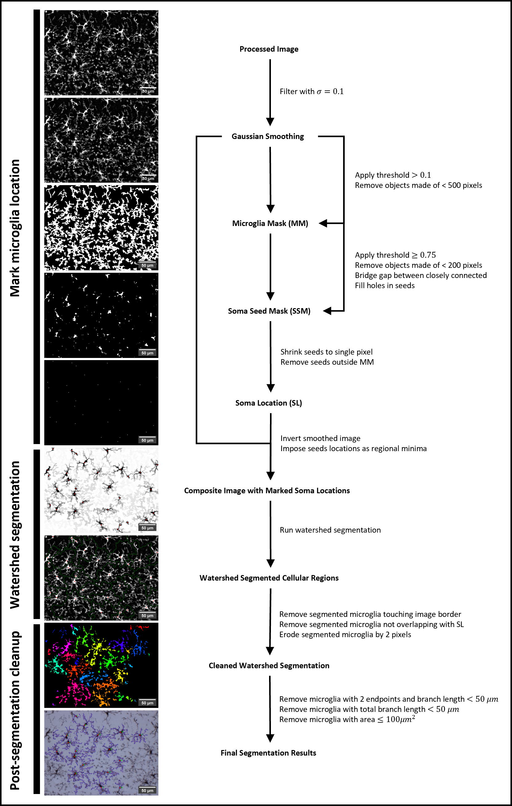

# miQglia
A set of MATLAB scripts for quantification of microglia images acquired through
brightfield microscopy.

>Image processing and enhancement


> Marker-controller watershed segmentation of microglia




> Fractal analysis



## Image Processing
Input images are preprocessed to enhace SNR for better cell segmentation. The
current preprocessing steps are:

1. Conversion to maximum intensity projection (MIP)
2. Denoising with 2D Weiner filter
3. Background feature removal with a top-hat filter
4. FFT bandpass filter
5. Image sharpening

The culmination of image processing in this order yielded the best segmentation
results.

## Watershed Image Segmentation
> Steps in marker-controlled watershed segmentation



The processed image is subtly blurred with a Gaussian filter, using the MATLAB
function `imgaussfilt`. A microglia mask (MM) is then created by thresholding
the Gaussian smoothed image, which is also subsequently used to create a soma
seed mask (SSM) by applying a higher threshold to demarcate bright regions
likely to be soma. Regions in SMM were shrunk to point-pixel and regions outside
of MM were removed to identify and index soma locations (SL). Then, a composite
image is created for marker-controlled watershed segmentation by imposing SL
onto inverted gaussian-smoothed as regional minima. The composite image
undergoes watershed segmentation to identify microglia. Microglia touching the
border or not overlapping with SL are first removed, then eroded by two pixels
to clean up watershed segmentation results. Microglia are then quantified by
metrics in the table below and any microglia with exclusion criteria are
rejected and removed.

## Microglia Quantification
### Skeleton Analysis
Metrics are based on skeletonized microglia to capture their complicated network
process

<dl>
  <dt><strong>1. BranchPoints</strong></dt>
  <dd>Total number of branch points detected in microglia.</dd>
  <dt><strong>2. EndPoints</strong></dt>
  <dd>Total number of end points detected in microglia.</dd>
  <dt><strong>3. Branches</strong></dt>
  <dd>Total number of branched segments in image.</dd>
  <dt><strong>4. MaxBranchLength</strong></dt>
  <dd>Length of the largest branch found in microns (μm).</dd>
  <dt><strong>5. AverageBranchLength</strong></dt>
  <dd>Average branch length in microns (μm).</dd>
  <dt><strong>6. TotalBranchLength</strong></dt>
  <dd>Sum of all processes lengths on microglia.</dd>
</dl>

### Fractal Analysis
A set of measures to quantify complexity of microglia structure.

<dl>
  <dt><strong>1. Cell Area</strong></dt>
  <dd>Area of pixels occupied by cell in microns (μm2) i.e., area of microglia. Also known as cell area (CA).</dd>
  <dt><strong>2. Cell Perimeter</strong></dt>
  <dd>Distance around the boundary of microglia in microns (μm) i.e. perimeter of microglia. Also known as cell perimeter (CP).</dd>
  <dt><strong>3. Fractal Dimension</strong></dt>
  <dd>Unitless measure of microglia complexity</dd>
  <dt><strong>4. Cell Circularity</strong></dt>
  <dd>Roundness of microglia. A perfect circle has a value of 0, whereas an ellipsoid has a value of 1.</dd>
  <dt><strong>5. Span Ratio</strong></dt>
  <dd>Ratio of convex hull ellipse’s minor length to major length, a measure of microglia elongation</dd>
  <dt><strong>6. Density</strong></dt>
  <dd>Ratio of cell area (CA) to the convex hull area (CHA). This measure is an indicator of cell size. The higher the density, the smaller the microglia.</dd>
  <dt><strong>7. Convex Hull Area</strong></dt>
  <dd>Convex hull is the smaller convex polygon that containing the whole microglia. All interior angles of a convex hull are smaller than 180ᵒ. The convex hull area (CHA) is the area of pixels occupied by convex hull in microns (μm).</dd>
  <dt><strong>8. Convex Hull Perimeter</strong></dt>
  <dd>Distance around the boundary of convex hull in microns (μm) i.e. perimeter of convex hull.</dd>
  <dt><strong>9. Convex Hull Circularity</strong></dt>
  <dd>Roundness of convex hull. A perfect circle has a value of 0, whereas an ellipsoid has a value of 1.</dd>
  <dt><strong>10. Roughness</strong></dt>
  <dd>Ratio of cell perimeter (CP) to convex hull perimeter (CHP).</dd>
</dl>

## Usage
Change the variable `pixel_micron` in L31 of _ramificationStats.m_ to your pixel
to micron ratio. Then, call the function `ramificationStats('Path to input image', 'Path to output directory')` to compute, process, and quantify an image containing microglia.

Example:
```
>> cell_stats = ramificationStats("D:\Datasets\Morphology\data\Benchmark\Input\w1t5m18_s20_40x_Sub2.TIF",'D:\SystemFiles\siddh\\Projects\\Mouse_Histology\Output');
```
